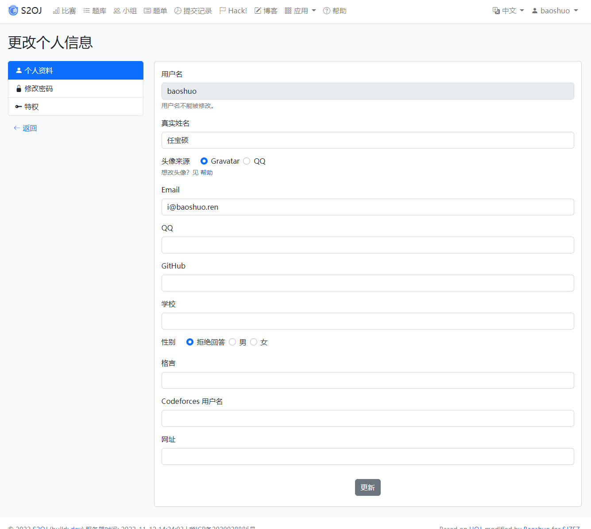
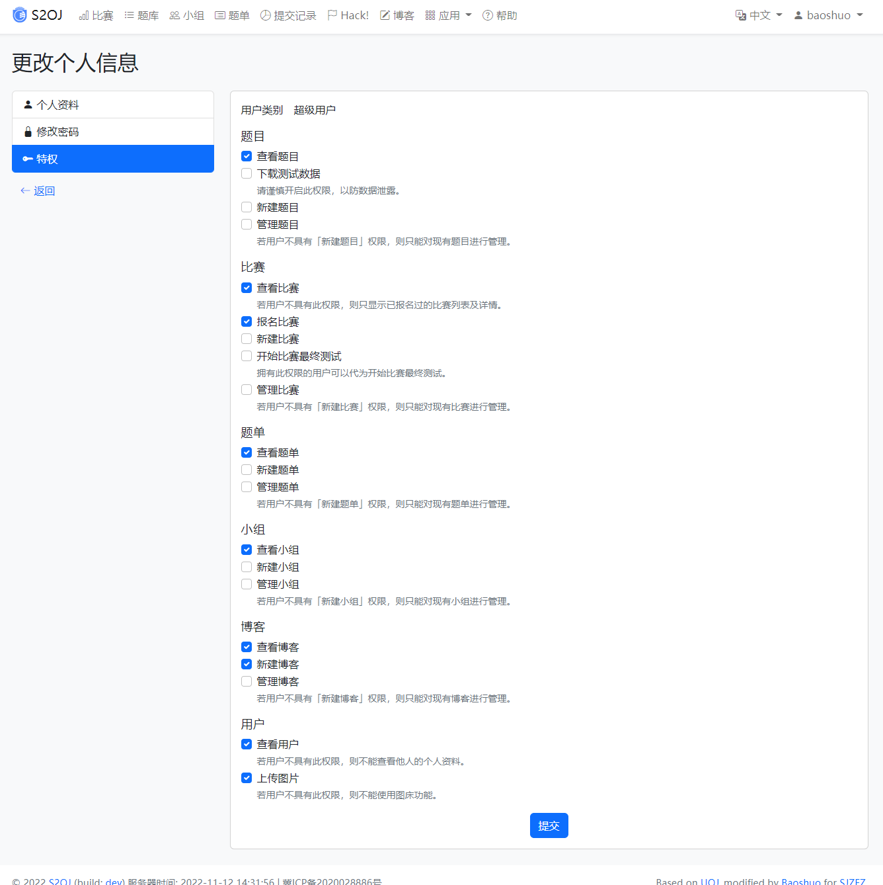
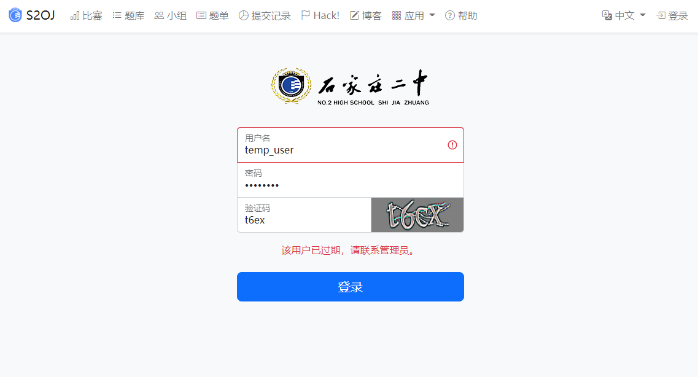

# 用户账号

?> _待填坑_

## 头像

S2OJ 支持 Gravatar 和 QQ 两种头像来源。默认情况下会使用 Gravatar 头像，但可以在「更改个人信息」页面选择使用 QQ 头像。

使用 QQ 头像前必须先填写 QQ 号。

## 更改个人信息

用户不可自行修改的信息：

- 用户名
- 真实姓名
- 学校

## 权限

详细的权限介绍请在 [权限管理](/manage/permissions.md) 页面查看。

## 常见问题

### 账号过期

请联系管理员解决。
