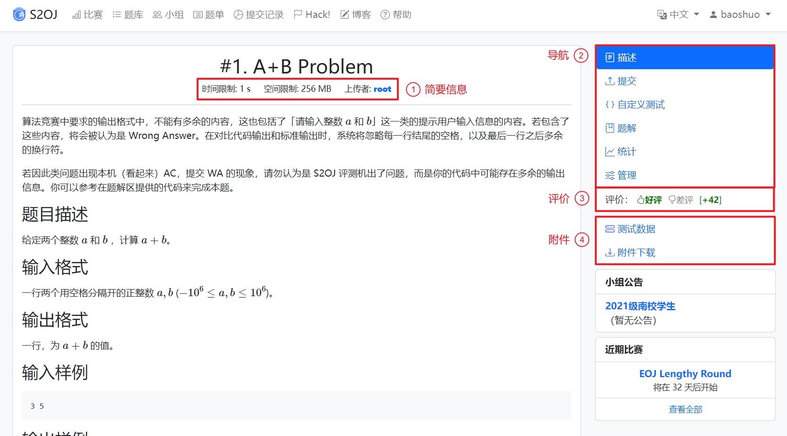

# 题库使用指南

## 题目页面

### 题目描述

### 题目提交

#### 本地题目

#### Remote Judge 题目

在提交页面，会根据远程 OJ 类型显示可用的提交方式。

##### 公用账号

如果远程 OJ 支持使用公用账号提交，直接选择「公用账号」即可提交题目。

##### 自有账号

在图中红框处可以填写远程账号信息。填写完成后点击「验证」按钮即可验证远程凭据是否有效。

##### 存档

按照与「自有账号」相同的步骤填写远程账号信息后，在输入框中填写提交记录 ID 即可。

### 题解

可以通过页面右侧的「增加题解」表单为本题提交题解。如果没有写好的博客文章，可以点击「快速新建文章」来新建一篇博文并提交题解。
